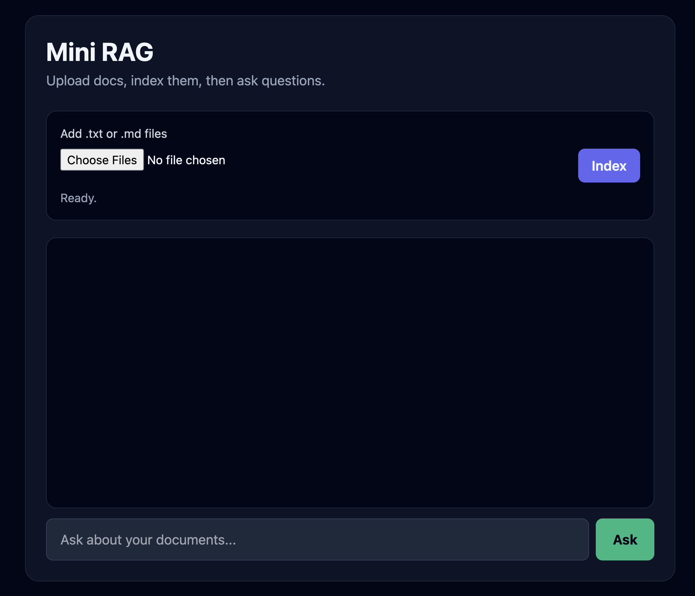
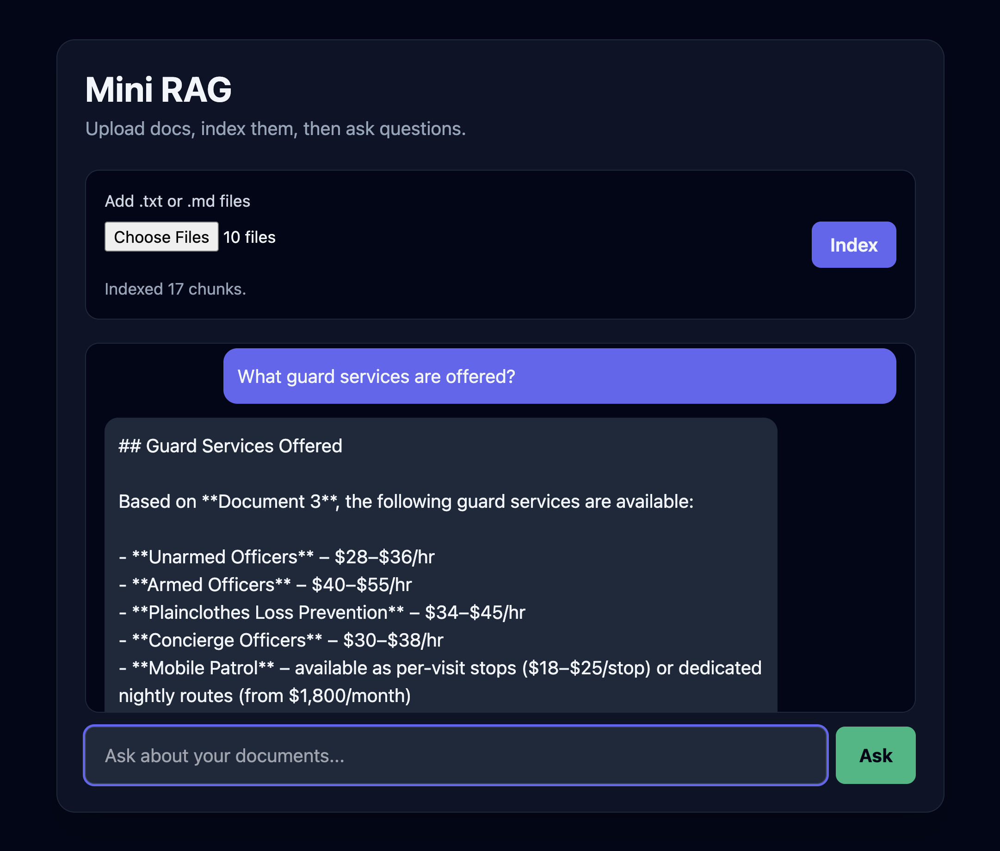

# Mini RAG — Web UI

A browser-based chat interface for [Mini RAG](../README.md). Upload `.txt` or `.md` documents, index them with one click, and ask questions — all without using the command line.

## Features

- **Responsive UI** — Tailwind CSS layout that works on desktop and mobile
- **Document upload** — Index multiple `.txt` / `.md` files via the browser
- **Chat-style Q&A** — Ask questions and get answers grounded in your documents (same `MiniRAG` class as the CLI)
- **Persistent index** — Shares `knowledge_base.json` with the CLI tool

## Prerequisites

- Python 3.10+
- An [Anthropic API key](https://console.anthropic.com/)

## Setup

From the `mini-rag/` directory:

```bash
# 1. Create and activate a virtual environment (recommended)
python -m venv .venv
source .venv/bin/activate   # Windows: .venv\Scripts\activate

# 2. Install dependencies
pip install anthropic numpy flask
```

### API key

Create a `.env` file in the **repository root** (two levels above `web/`):

```bash
# ../../.env
ANTHROPIC_API_KEY=your_key_here
```

The web app loads this automatically at startup. You can also export the variable instead:

```bash
export ANTHROPIC_API_KEY=your_key_here
```

## Run locally

```bash
cd mini-rag
python web/app.py
```

Open [http://localhost:5000](http://localhost:5000) in your browser.

## Usage

1. **Upload documents** — Click *Add .txt or .md files*, select one or more files (sample docs are in [`uploads/`](uploads/) if you want to try without preparing your own), then click **Index**.
2. **Ask a question** — Type in the chat box and press Enter or click **Ask**.
3. **Review the answer** — Responses cite which document they came from, matching CLI behavior.

### Example questions

After indexing the files in `uploads/`:

- *What guard services are offered?*
- *How does pricing work?*
- *What is the incident response process?*

## Fix to make it work (`rag.py`)

While testing the web UI with the 10 sample `.md` files in [`uploads/`](uploads/), indexing and search broke because of how `simple_embedding` built vectors.

### Problem

The original implementation sized the vector from each chunk's vocabulary and stored word frequencies by vocab index:

```python
def simple_embedding(self, text: str) -> np.ndarray:
    """Create simple word-frequency based embedding (no API needed)."""
    words = text.lower().split()
    vocab = sorted(set(words))
    vector = np.zeros(min(len(vocab), 100))
    for i, word in enumerate(vocab[:100]):
        vector[i] = words.count(word) / len(words)
    return vector / (np.linalg.norm(vector) + 1e-10)
```

Two issues showed up when indexing multiple files:

1. **Inconsistent dimensions** — `min(len(vocab), 100)` produced vectors of different lengths across chunks. When saved to and loaded from `knowledge_base.json`, this broke similarity search (`np.dot`) across the full index.
2. **No shared vocabulary** — Each chunk assigned words to positions by its own sorted vocab (`vector[i] = ...`), so the same word sat at different indices in different documents. Retrieval quality suffered when querying across all 10 uploaded files.

### Fix

`simple_embedding` now uses a fixed 100-dimensional vector with `hash(word) % 100` to place word frequencies:

```python
def simple_embedding(self, text: str) -> np.ndarray:
    """Create simple word-frequency based embedding (no API needed)."""
    words = text.lower().split()
    vocab = sorted(set(words))
    vector = np.zeros(100)
    for i, word in enumerate(vocab[:100]):
        vector[hash(word) % 100] += 1 / len(words)
    return vector / (np.linalg.norm(vector) + 1e-10)
```

Every chunk produces a 100-dim vector, and the same word always maps to the same bucket across documents.

### Verification

Tested end-to-end by indexing all 10 files in `uploads/` through the web UI and querying across topics (guard services, pricing, incident response, etc.). Search and answers worked correctly after this change.

## Screenshots

| Home / upload | Chat with cited answer |
|---|---|
|  |  |

## How it works

The web layer is a thin Flask wrapper around the existing `MiniRAG` class in [`rag.py`](../rag.py):

```
Browser  →  POST /upload  →  rag.add_file()  →  rag.save(knowledge_base.json)
Browser  →  POST /ask     →  rag.query()     →  Claude + retrieved chunks
```

- **`GET /`** — Serves the HTML chat UI
- **`POST /upload`** — Saves uploaded files to `uploads/`, indexes them, persists the knowledge base
- **`POST /ask`** — Runs semantic search + Claude answer generation

The CLI and web UI share the same `knowledge_base.json`, so you can index from either interface.

## Project structure

```
web/
├── app.py          # Flask app + embedded HTML/JS UI
├── uploads/        # Uploaded documents (created at runtime)
├── assets/         # Screenshots for this README
└── README.md       # This file
```

## Troubleshooting

| Issue | Fix |
|---|---|
| `ANTHROPIC_API_KEY not set` | Add the key to `.env` at the repo root or export it, then restart the server |
| `ModuleNotFoundError: rag` | Run `python web/app.py` from the `mini-rag/` directory (or ensure `mini-rag/` is on `PYTHONPATH`) |
| Empty or wrong answers | Click **Index** after uploading; confirm the status shows indexed chunk count |
| Port already in use | Change the port in `app.py`: `app.run(debug=True, port=5001)` |

## CLI alternative

The same knowledge base works from the terminal:

```bash
python rag.py index web/uploads
python rag.py query "What guard services are offered?"
```
